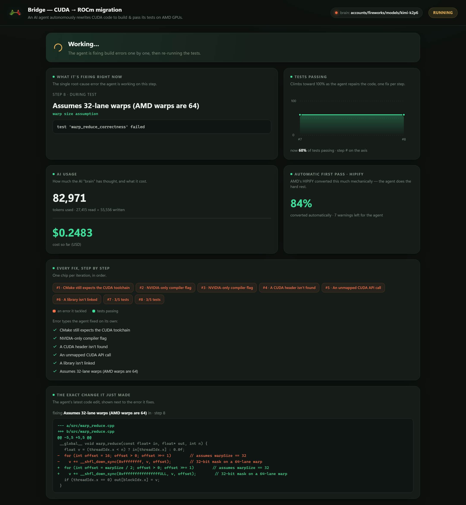
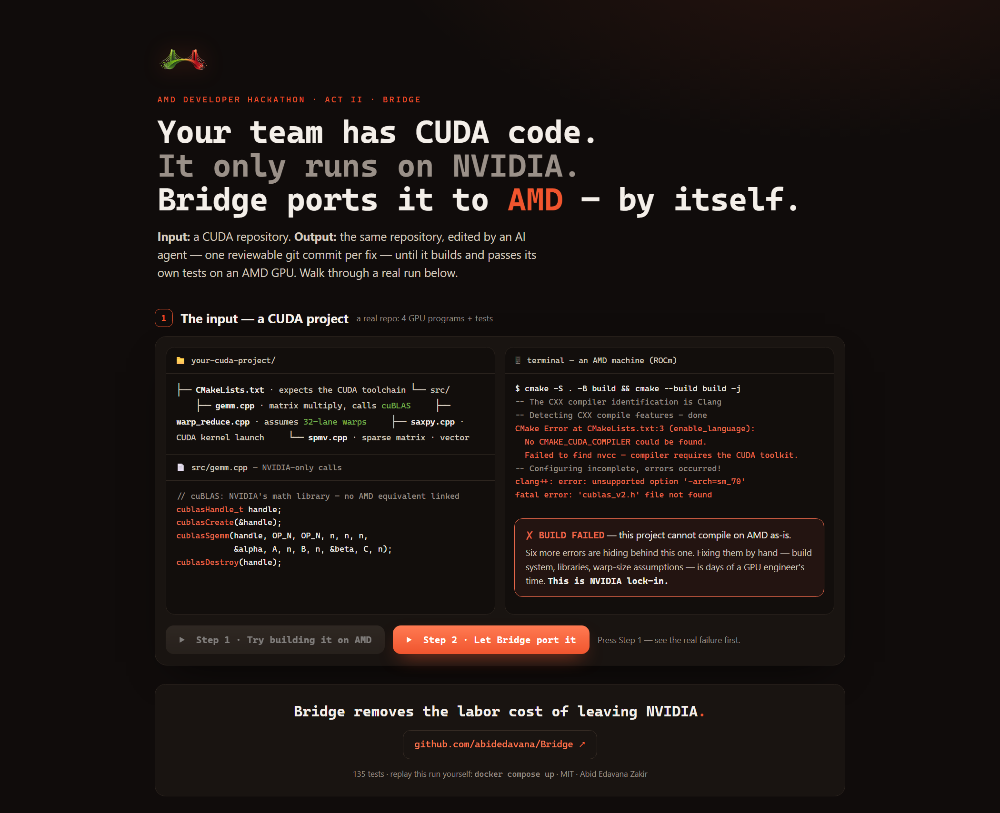

# Bridge

**An autonomous CUDA → ROCm/HIP migration agent.**

> **▶ See it run — no install: [abidedavana.github.io/Bridge/demo](https://abidedavana.github.io/Bridge/demo/)** —
> the whole migration in one click: the real build failure, the agent's fixes, `SUCCESS`.
> Prefer it live on your machine? `docker compose up` → http://localhost:8000.



<sub>The live dashboard mid-run: the agent fixing the AMD warp-size assumption (32-lane →
`warpSize/2`, `0xffffffff` → the 64-bit mask), the pass rate climbing, real token cost — and
**the exact diff it just wrote**. Every fix is a real git commit; replays offline with
`docker compose up`, no GPU or API key. ([interactive walkthrough](https://abidedavana.github.io/Bridge/demo/) ·
[the full story, end to end](docs/img/demo-output.png))</sub>

Bridge takes a git repository containing CUDA code and ports it to ROCm/HIP so it
builds and passes its test suite on an AMD GPU — and it can run its own reasoning
*on* AMD, with its LLM brain served by vLLM.

### The problem it removes — CUDA code that won't build on AMD, fixed autonomously



HIPIFY does the mechanical 90%. Bridge earns its keep on the last mile: build
systems (CMake/Make), APIs HIPIFY misses, `cuBLAS`→`hipBLAS`/`rocBLAS` quirks,
warp-size 32-vs-64 assumptions on CDNA, `__shfl_sync` semantics,
`-arch=sm_XX` → `--offload-arch=gfx942`, and header/link failures. When it can't
finish a migration it says so precisely — every run ends in a complete, honest
report ("HIPIFY got X%, Bridge autonomously fixed these classes, these remain").

> **Status:** built, verified — **143 tests passing** — and **proven on real AMD
> hardware**: on 2026-07-08 Bridge autonomously ported a CUDA project to a
> passing test on a Radeon GPU pod (`gfx1100`, ROCm 7.2). Everything below runs
> on a laptop with **no GPU and no API key**, replaying genuine recorded runs.

## Results (all runs real and recorded; no synthetic outcomes)

| Run | Brain | Outcome |
| --- | --- | --- |
| Recorded live migration (the demo) | Kimi K2.6 (Fireworks) | **SUCCESS** — 11 iterations, all **7/7 error classes** fixed autonomously, incl. the 64-bit CDNA warp-mask fix; ~$0.30 at list price |
| **On AMD hardware** (gfx1100 pod, real hipcc builds) | Kimi K2.6 (Fireworks) | **SUCCESS** — 3 iterations, 2 policy-gated CMake fixes, `ctest` **100%** on the GPU; ~$0.05 (idiomatic find_package(hip) port) |
| On-hardware honest degradation | Kimi K2.6 (Fireworks) | **PARTIAL** — agent targeted the wrong GPU arch (prompts then hardcoded MI300X; fixed, test-pinned), stopped honestly; a one-line human arch fix → `ctest` 100% |
| Gemma comparison (same scenario as the demo) | Gemma 4 31B (AI Studio) | **STUCK** — **3/7 classes fixed** before the free-tier endpoint 500'd; first attempt managed 1/7 until `<thought>`-markup extraction was hardened |

The security gate behaved identically in every run, whichever brain was driving.

---

## 30-second demo (no GPU, no API key)

From a fresh clone, with Docker:

```bash
docker compose up
```

Open **http://localhost:8000**. A full CUDA→ROCm migration climbs to `SUCCESS`
live and on a loop: the pass-rate chart rising per iteration, each agent-written
diff shown beside the error it fixed, the error classes fixed autonomously,
HIPIFY's conversion %, a token/cost counter, and an endpoint badge. Every fix is a
**real git commit** in a scratch repo (`bridge(iter N, <error_class>): …`). This
demo is a **recording**, which is why it needs no GPU and no key: the brain's
replies replay from a cassette of a genuine Fireworks (Kimi K2.6) run, and the
compile/test results from captured GPU fixtures. To run it for real — your repo,
your key, a live model — see [Run it on your own CUDA repo](#run-it-on-your-own-cuda-repo-live).

### No Docker? Run it natively

Requires Python 3.10+ and git. One command, one terminal — it serves the
dashboard, opens your browser, and replays the recorded migration:

```bash
python -m pip install -e ".[dashboard]"
bridge demo
```

(Headless variant, report only: `bridge demo --headless`.)

## Run it on your own CUDA repo (live)

The demos above are recordings so they work with no GPU or key. To port a
**real** repo, on a machine with ROCm and your CUDA repo checked out:

```bash
python -m pip install -e ".[llm,dashboard]"
bridge init                            # guided setup: detects your GPU arch and
                                       # build system, writes a validated config.yaml
export BRIDGE_LLM_API_KEY=fw_your_key  # Fireworks, or any OpenAI-compatible key
bridge run --dashboard                 # ports the repo; watch live at http://127.0.0.1:8000
```

`bridge init` detects the GPU (`rocm_agent_enumerator`/`rocminfo`), whether the
repo builds with CMake or Make, and where its `.cu` files live — you confirm or
edit each answer, and the result is round-tripped through the config schema
before it is written. Every field it writes is documented in
[config.example.yaml](config.example.yaml) if you'd rather edit by hand;
`bridge validate` re-checks any config.

Bridge edits your repo in place and commits one fix per iteration, ending in an
honest `SUCCESS` / `PARTIAL` / `STUCK` report — review the branch it produced.
(Prefer not to run on your host? `bridge init` can also configure `ssh` mode,
which drives a remote AMD box.)

## The hardware run — a real autonomous migration recorded on AMD hardware (gfx1100)

On 2026-07-08, on an AMD hackathon GPU pod (Radeon PRO W7900-class, `gfx1100`,
ROCm 7.2), Bridge autonomously ported this CUDA project for real: live Kimi K2.6
diagnosed cmake's actual (ANSI-colored) errors, two policy-gated fixes landed as
real commits, and the ported binary passed `ctest` on the GPU — 3 iterations,
~$0.05. That run's unmodified recording is
[fixtures/cassettes/hardware.json](fixtures/cassettes/hardware.json); the build
and test logs in its replay scenario are the genuine captured pod outputs.
Replay it, no GPU or key needed:

```bash
bridge demo --config config.replay.hardware.yaml    # in the browser
python -m bridge run --config config.replay.hardware.yaml    # headless report
```

## Graceful degradation is a feature

Point it at the other scenarios (copy `config.replay.example.yaml`, change
`scenario:`) to see the honest outcomes:

- **SUCCESS** — build green, all tests pass.
- **PARTIAL** — build green, but one fp32-tolerance test can't be fixed without
  cheating (policy forbids it), so it stops at a real number and reports it.
- **STUCK** — build never goes green; tests never run, and the report says exactly
  that. Nothing crashes; nothing claims success.

## Real hardware

One config switch runs the identical loop on real hardware: `executor.kind:
local` runs Bridge **on** the GPU box itself (the path used for the recorded
gfx1100 run), and `executor.kind: ssh` drives a remote Instinct box; another
line (`llm.base_url`) points the brain at Fireworks or a self-hosted vLLM
server. The vLLM serving script and the demo-repo picker are ready:

- [scripts/serve_vllm_rocm.sh](scripts/serve_vllm_rocm.sh) — serve the brain on AMD.
- `python -m bridge shortlist --config config.example.yaml --repos shortlist.example.yaml`
  — rank candidate CUDA repos "closest to green, most interesting failures"
  (put your repo URLs in the example file first; it ships with placeholders).

## Best Use of Gemma — the model-comparison run

The brain is any OpenAI-compatible endpoint, and the safety gate never trusts it
either way — so swapping models is a one-line config change, not a refactor. For
the Gemma challenge we ran the identical migration with **Gemma 4 31B** (Google
AI Studio) as the brain, recorded at
[fixtures/cassettes/gemma.live.json](fixtures/cassettes/gemma.live.json)
(config: [config.gemma.laptop.yaml](config.gemma.laptop.yaml)).

Access path, honestly: the hackathon names Fireworks as the Gemma route, but
this account's Fireworks *serverless* endpoint listed no Gemma model (every
Gemma id returned 404 NOT_FOUND when probed on 2026-07-09; an on-demand
dedicated deployment is a paid spin-up we skipped), so the comparison ran
against Google AI Studio's hosted **Gemma 4 31B** instead — same agent, same
scenario, one config line.

The honest result: Gemma 4 fixed **3 of the 7 error classes autonomously**
(`cmake_cuda_language`, `arch_flag_unsupported`, `missing_cuda_header`) before
the free-tier endpoint began returning 500s and the run degraded, honestly, to
STUCK (`llm_endpoint_unreachable`) — versus Kimi K2.6's 7 of 7. The comparison
also produced a real finding: Gemma 4 interleaves `<thought>` markup through its
replies, which broke diff extraction on the first attempt (1 fix); Bridge's
messy-output hardening now strips thought spans (test-pinned with the recorded
reply shape), which took Gemma from 1 fix to 3. The architectural point stands:
diagnosis quality varies by brain, but the mechanical patch policy gate held
identically for both models.

## Tests & CI

```bash
python -m pip install pytest httpx
python -m pytest -q          # 143 tests
```

Written to convince a skeptical judge, not just to pass CI: authentic ROCm/clang
fixture text, real git commits driving the loop, a property test that no sequence
of executor/model output can crash the orchestrator, the patch policy engine
rejecting a live prompt-injection payload, messy-model-output hardening, and a
deterministic SUCCESS/PARTIAL/STUCK end-to-end run. CI (GitHub Actions) runs the
suite plus the offline e2e on every push.

## How it works

```
clone repo → HIPIFY → build → parse errors → diagnose (LLM) → propose diff →
  policy gate → git apply → commit → rebuild →  (green) → run tests → (same loop)
  → SUCCESS / PARTIAL / STUCK, always with a complete report
```

Two seams make it testable and safe: the **`Executor`** interface (`mock` replays
real logs with zero GPU; `local` runs on the AMD box itself — the path the gfx1100
run used; `ssh` drives a remote AMD Instinct box — one config switch), and the
**LLM backend** (`openai` for Fireworks/vLLM; `replay` for a deterministic
recorded run). Plain Python, an explicit state machine, no agent frameworks.

## Security posture

Bridge clones an **untrusted** repo, runs its build/tests (arbitrary code
execution), and applies **LLM-generated** diffs — a stack of trust boundaries it
treats as one. Guardrails are mechanical and enforced on the diff *before* it is
applied, so they hold even under indirect prompt injection from a hostile repo: a
writable-path allowlist, a never-touch protected list, a denylist of dangerous
insertions (shell-out, network egress, `eval`), a size cap, and a ban on editing
test files. The `poisoned` fixture is a repo that attempts exactly this attack;
a test proves the gate rejects it. See [THREAT_MODEL.md](THREAT_MODEL.md).

## Repository layout

```
bridge/
  config.py          typed, validated config schema (one YAML file)
  executor/          the Executor seam: base + local + mock (fixtures) + ssh
  parser/            raw ROCm/clang/ctest output -> structured, ranked diagnostics
  llm/               OpenAI-compatible + replay + recording backends; output hardening
  patcher/           the mechanical policy gate + atomic git-apply
  agent/             context builder, diagnose/propose stages, orchestrator loop
  dashboard/         FastAPI + one static page over the run state
  run_state.py       the persisted run log / dashboard feed
  shortlist.py       Day-1 demo-repo triage
  setup_wizard.py    `bridge init`: detect GPU + build system, write a valid config
  cli.py             demo | init | validate | run | dashboard | mock-demo | shortlist
prompts/             versioned diagnose + propose-edit prompts (+ CUDA→ROCm cheat-sheet)
fixtures/            real HIPIFY/ROCm/ctest logs, scenarios, seed + poisoned repos, cassette
scripts/             serve_vllm_rocm.sh
DECISIONS.md · THREAT_MODEL.md
```

## Team

- **Abid Edavana Zakir** — abidedavana@gmail.com — solo (design, implementation, security, tests).

## License

MIT — see [LICENSE](LICENSE). All work is original and open source.
